## Screenshots

### Logon Page
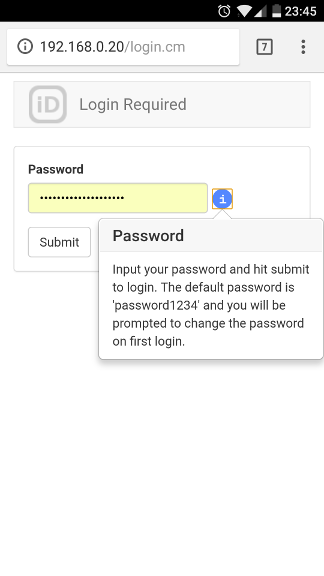
---
### Home
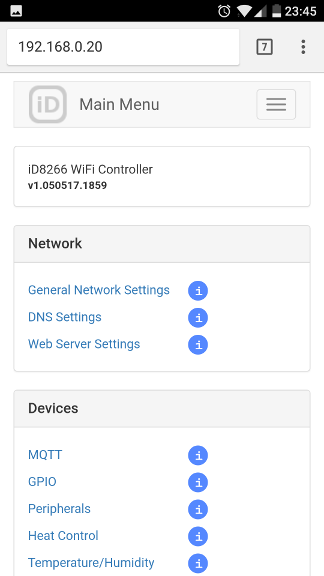
---
### Network Setup
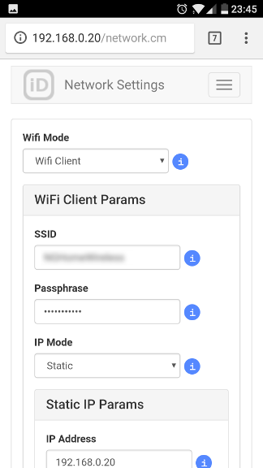
---
### DNS Confiiguration
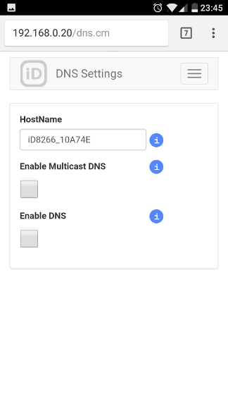
---
### Web Server Configuration
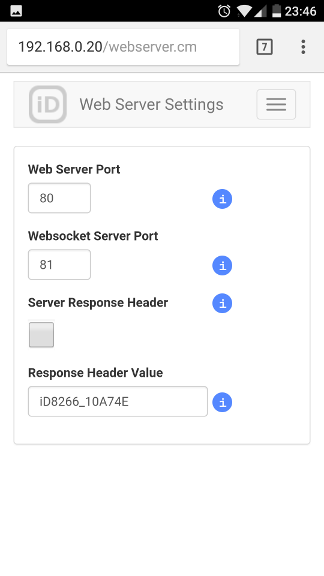
---
### MQTT Configuration
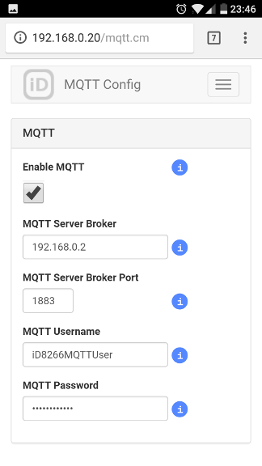
---
### GPIO Device Configuration
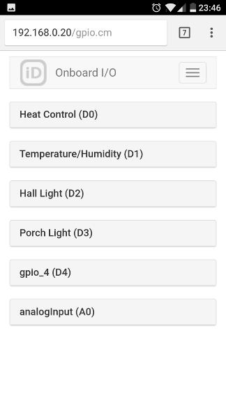
---
### Peripheral Configuration
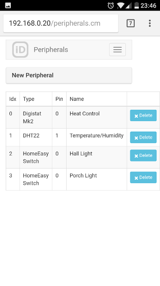
---
### System Menu Options
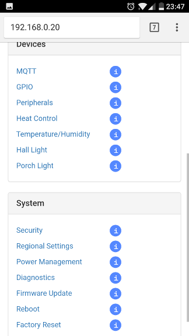
---
### Regional Options
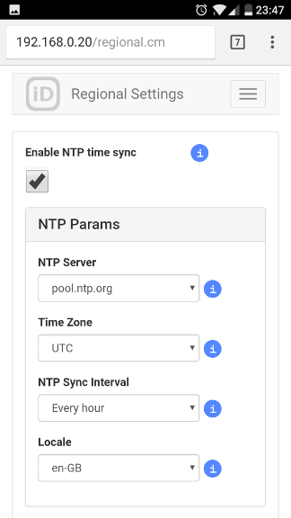
---
### Power Management
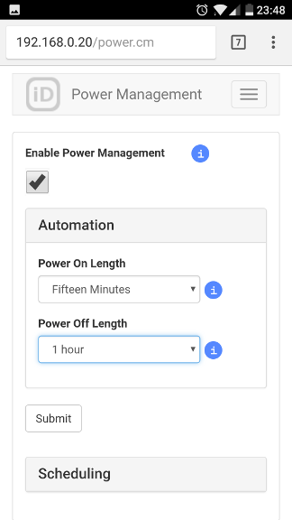
---
### OTA Flashing
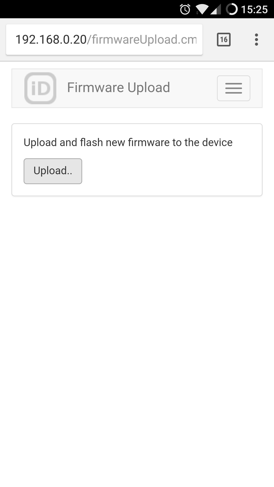
